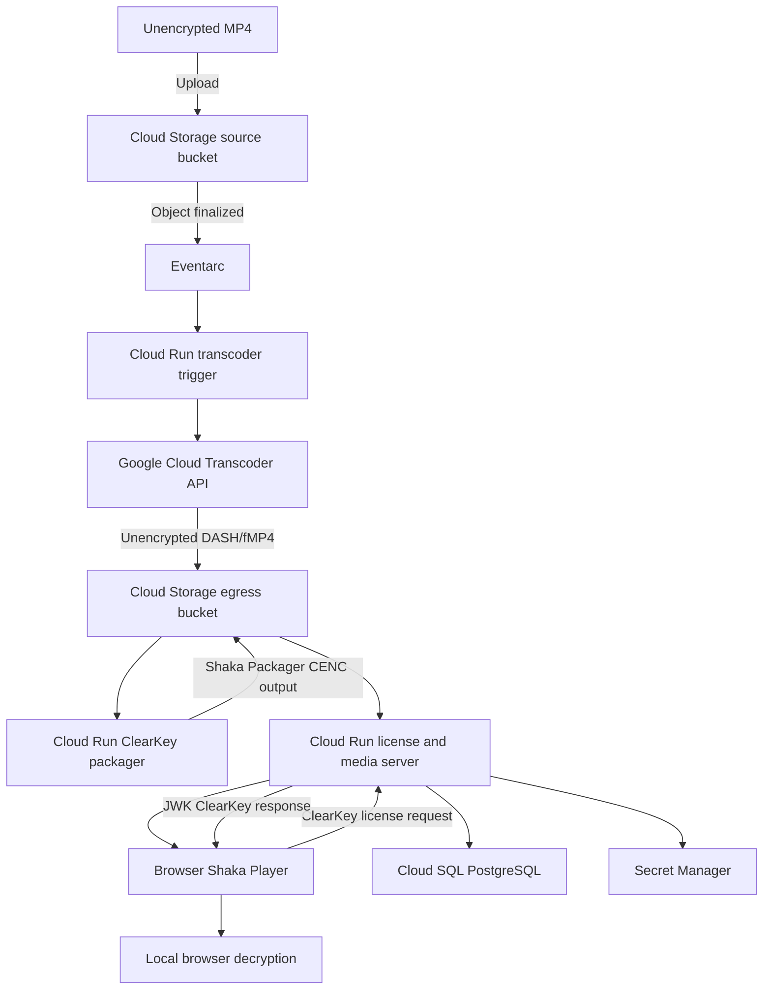

# GCP ClearKey Video Pipeline

This project is a Google Cloud proof of concept for transcoding, encrypting, and browser playback of video with ClearKey DRM.

It uses Google Cloud Transcoder API for encoding, Shaka Packager for CENC encryption, Cloud Run for the application services, Cloud Storage for media, Cloud SQL for entitlements, and Shaka Player in the browser.

## Architecture



## Workflow

1. Upload an MP4 to the source Cloud Storage bucket.
2. Eventarc invokes the `transcoder-trigger` Cloud Run service.
3. The trigger submits a DASH/fMP4 job to the Transcoder API.
4. Transcoder writes encoded output to the egress bucket.
5. The egress Eventarc trigger invokes `clear-key-packager`, which runs Shaka Packager with a raw 16-byte ClearKey.
6. The packager writes encrypted DASH output to `outputs/<video-id>/encrypted/`.
7. The license server proxies the encrypted manifest and media segments.
8. Shaka Player requests a ClearKey license from `/get-clearkey`.
9. The browser decrypts the stream locally.

This is a ClearKey learning POC. It is not equivalent to a production Widevine DRM deployment and should not expose the test key to untrusted users.

## GCP Resources

- Source bucket: `clearkey-video-gcp-source-pineapple`
- Egress bucket: `clearkey-video-gcp-egress-pineapple`
- Terraform state bucket: `clearkey-video-gcp-tfstate-pineapple`
- Region: `europe-west2`
- Cloud SQL instance: `clearkey-license-db`
- Artifact Registry repository: `clearkey`
- Cloud Run services: `license-server`, `transcoder-trigger`, `clear-key-packager`
- Eventarc trigger: `source-mp4-finalized`

The source and egress buckets are private. Runtime service accounts access them through IAM. The current Cloud SQL instance allows public access because this is a POC; restrict it before production use.

## Prerequisites

Install and authenticate the Google Cloud CLI and Terraform, then select the project:

```bash
gcloud auth login
gcloud config set project clearkey-video-gcp
```

The setup script enables the following APIs before initializing Terraform:

```bash
gcloud services enable \
  artifactregistry.googleapis.com \
  cloudbuild.googleapis.com \
  eventarc.googleapis.com \
  run.googleapis.com \
  secretmanager.googleapis.com \
  sqladmin.googleapis.com \
  storage.googleapis.com \
  transcoder.googleapis.com
```

If `--db-password` and `--clear-key-value` are omitted, the setup script generates both values in memory and stores them in Secret Manager. The ClearKey value is a random 32-character hexadecimal value. Explicit values can be supplied when repeatable credentials are required:

```bash
python3 setup.py \
  --db-password 'your-db-password' \
  --clear-key-value '0123456789abcdef0123456789abcdef'
```

The ClearKey value must contain exactly 32 hexadecimal characters and must not include a trailing newline. Generated values are not printed or written to the repository.

## Deployment

The GCP setup script initializes the GCS Terraform backend, imports resources created manually when present, supplies the secrets, applies Terraform, and prints service outputs. Terraform builds all three container images before creating the Cloud Run services:

```bash
python3 setup.py
```

The setup script creates the Terraform state bucket if it does not exist. The state bucket is intentionally retained between deployments because Terraform needs it before `terraform init` and uses it to preserve infrastructure state. The project itself, billing, and `gcloud auth login` must already be configured.

Use alternate project or region values when needed:

```bash
python3 setup.py \
  --project-id clearkey-video-gcp \
  --region europe-west2
```

The separate Terraform root is in [terraform_gcp](terraform_gcp).

For Terraform-only operations:

```bash
terraform -chdir=terraform_gcp init
terraform -chdir=terraform_gcp validate
terraform -chdir=terraform_gcp plan
terraform -chdir=terraform_gcp apply
```

## Testing the Pipeline

Upload a video:

```bash
gcloud storage cp ./13028454_1920_1080_60fps.mp4 \
  gs://clearkey-video-gcp-source-pineapple/demo-final.mp4
```

Check Transcoder jobs:

```bash
gcloud transcoder jobs list \
  --project=clearkey-video-gcp \
  --location=europe-west2
```

The encrypted output is stored under:

```text
gs://clearkey-video-gcp-egress-pineapple/outputs/demo-final/encrypted/
```

The player manifest endpoint is:

```text
https://license-server-2j6vscsfjq-nw.a.run.app/streams/demo-final/manifest.mpd
```

To use the local player page, serve the repository directory over HTTP rather than opening the HTML file directly:

```bash
python3 -m http.server 8080
```

Then open `http://localhost:8080/index.html`.

## Security Notes

- ClearKey is intended for testing and education, not production content protection.
- The current license server has a test-key fallback for unknown key IDs; remove that fallback before production.
- Do not commit Secret Manager values, Terraform state, database passwords, or service-account keys.
- Keep the egress bucket private and expose media through an authenticated or controlled delivery layer.
- Replace the public Cloud SQL configuration with private connectivity before production use.
- Pin and verify container dependencies and Shaka Packager releases.

## IAM Model

The deployment uses separate service accounts for the Transcoder trigger, Transcoder service agent access, packaging, and the license server. Bucket access is granted per bucket and runtime role rather than project-wide storage administration.

The license server is public because a browser must request its manifest, segments, and ClearKey license. The transcoder trigger and packager are not public; Eventarc invokes them through their dedicated service account. Custom roles limit the Transcoder trigger to `transcoder.jobs.create`, `transcoder.jobs.get`, and `transcoder.jobs.list`. The Transcoder and packager media writer role contains only `storage.objects.create`, `storage.objects.delete`, `storage.objects.get`, and `storage.objects.list`, and is granted only on the egress bucket.

Cloud SQL currently permits public network access for learning purposes. That is the main intentional least-privilege exception and should be replaced with private connectivity before production.
