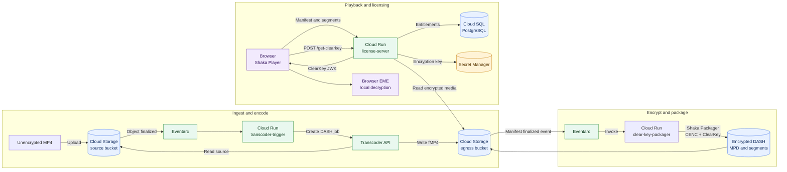

# GCP ClearKey Video Workflow

This document describes the current proof-of-concept workflow implemented in this repository.

## Workflow Diagram



## Step 1: Upload

An MP4 is uploaded to the source bucket:

```bash
gcloud storage cp video.mp4 \
  gs://clearkey-video-gcp-source-<bucket-suffix>/example.mp4
```

The source bucket is private and has uniform bucket-level access enabled.

## Step 2: Eventarc trigger

The `source-mp4-finalized` Eventarc trigger watches for finalized objects in the source bucket. The trigger invokes the `transcoder-trigger` Cloud Run service.

The service ignores objects that are not `.mp4` files and submits a Transcoder API job for accepted uploads.

## Step 3: Transcoder API

The trigger creates a Transcoder API job with:

- H.264 video
- 1280x720 output
- 5 Mbps target bitrate
- fMP4 container
- Six-second media segments
- DASH manifest output

The initial POC configuration is video-only because the repository test file has no audio track.

Output is written to:

```text
gs://clearkey-video-gcp-egress-<bucket-suffix>/outputs/<video-id>/
```

The trigger checks existing Transcoder jobs by source label before creating a new job, so Eventarc retries do not normally create duplicate jobs.

## Step 4: Shaka Packager encryption

The `clear-key-packager` Cloud Run service packages the Transcoder fMP4 output with Shaka Packager.

It uses:

- Common Encryption (`cenc`)
- A 16-byte raw ClearKey
- A 16-byte key ID
- ClearKey DASH signaling
- Shaka Packager v3.9.3

The service is invoked automatically by the `egress-manifest-finalized` Eventarc trigger when the Transcoder manifest is written:

```bash
PACKAGER_URL="$(gcloud run services describe clear-key-packager \
  --project=clearkey-video-gcp \
  --region=europe-west2 \
  --format='value(status.url)')"

curl -X POST "$PACKAGER_URL/package/example"
```

The manual endpoint remains available for retries and testing. Normal uploads use the Eventarc trigger.

Encrypted output is written to:

```text
gs://clearkey-video-gcp-egress-<bucket-suffix>/outputs/<video-id>/encrypted/
```

The output includes:

```text
dash_clearkey.mpd
init.mp4
segment_1.m4s
segment_2.m4s
```

## Step 5: Playback delivery

The license server exposes the encrypted manifest through:

```text
GET /streams/<video-id>/manifest.mpd
```

It also proxies the relative media files used by the manifest:

```text
GET /streams/<video-id>/init.mp4
GET /streams/<video-id>/segment_<number>.m4s
```

This allows the browser to use one HTTPS Cloud Run origin while the egress bucket remains private.

The current test manifest is:

```text
https://license-server-2j6vscsfjq-nw.a.run.app/streams/demo-final/manifest.mpd
```

## Step 6: ClearKey license request

Shaka Player reads the ClearKey signaling from the DASH manifest and sends a JSON license request to:

```text
POST /get-clearkey
```

The request contains a base64url-encoded key ID. The license server:

1. Decodes the requested key ID.
2. Looks up an active entitlement in Cloud SQL.
3. Returns a ClearKey JWK response.
4. Allows the browser's EME implementation to decrypt the media locally.

The current POC includes a test-key fallback for unknown key IDs. That fallback must be removed before production use.

## Security Boundaries

- Infrastructure provisioning uses the dedicated `clearkey-terraform-deployer` service account. Human or CI identities impersonate it rather than using a deployer key.
- The deployer can use the three workload service accounts through `roles/iam.serviceAccountUser`, but those workload accounts cannot administer the project.
- Source MP4 files are unencrypted while stored in the source bucket.
- Transcoder output is initially unencrypted until the packaging step completes.
- The egress bucket is private.
- The raw ClearKey is stored in Secret Manager and injected into the packager and license-server services.
- Cloud SQL stores entitlement mappings.
- The browser receives the ClearKey needed for local decryption, so ClearKey is suitable only for testing and learning.
- Cloud SQL currently allows public access because this is a POC.
- Eventarc invokes the Cloud Run trigger and packager through their dedicated service account; they are not publicly invokable.

## Operational Sequence

```text
1. Upload MP4
2. Wait for Transcoder job to succeed
3. Invoke /package/<video-id>
4. Confirm encrypted output exists
5. Open the player page
6. Shaka Player loads the manifest
7. Shaka Player requests the ClearKey license
8. Browser decrypts and plays the video
```

For deployment and infrastructure commands, see [README.md](README.md).
